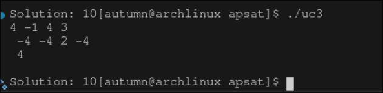

# APSAT
APSAT was planned to be a puzzle game based around B-SAT, but I unfortunately ran out of time and had to scrap the game. Below, You'll find the SAT solver I made for it. gen_formula() generates a formula in cnf form, which can be solved using solve(). Deploying this is as simple as
```git clone https://github.com/autumn-pan/apsat```

In the commit history, I believe you may view what I was planning. Unfortunately, I couldn't follow the theme, but I certainly will next time.

There are a few ways to use this. One way is to generate a string in CNF form, and then solve it using solve(char* formula). Otherwise, one must create a 2D array of integers, excluding zero, define the appropriate assignment map, and count the number of clauses to use solve_formula(). How this is done is shown in solve(char* formula).



Each line represents a clause, where each number is a boolean variable separated by OR statements, and each line is separated by AND statements. A negation in a variable means that it has an associated NOT statement. This is called CNF form and is the standard form for modern SAT solvers.

This project was originally made for the siege YSWS, but was never formally submitted to it, and thus I chose not to go through with that program. I dedicate this project solely to, and only to the Athena awards. DM me if you have questions.

I made this project to show what I've learned about boolean satisfiability. I made my project already knowing how to analyze strings, which let me quickly make a system that was capable of converting strings into boolean expressions. I used bitmaps to represent answers, and used this to brute force every single permutation possible and find the solution to any boolean expression. I struggled a bit with the early phases of lexical analysis because I have never tried to make something so small, but I learned a lot about NP Completeness and time complexity while working on this.

In it's current state, it's capable of generating, solving, and verifying boolean expressions and systems

[](https://award.athena.hackclub.com?utm_source=readme)